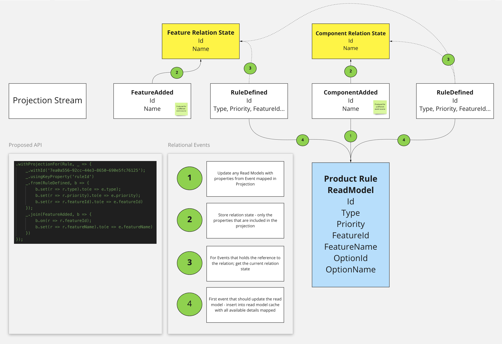

# Dolittle Projections

[](https://badge.fury.io/js/%40dolittle%2Fprojections)
[](https://github.com/dolittle-entropy/projections/actions?query=workflow%3A%22TypeScript+Library+CI%2FCD%22)
[](https://github.com/dolittle-entropy/projections/actions?query=workflow%3ACodeQL)

## Motivation and goals

The goal of this project is to prove the concept of a declarative projection engine for [Dolittle](https://dolittle.io) based on event sourcing.

### Problem

When working with event sourcing, the truth of a system is defined in the events. These are stored in an event store.
For Dolittle, we have an event-log which is the main storage for events and any processors of these has their own
filtered stream representation of the events. The events in the event-log and any sub streams are in order, typically
partitioned by its event source identifier.

When using the events to generate state, typically referred to as view cache or read models - the process involves
typical [CRUD](https://en.wikipedia.org/wiki/Create,_read,_update_and_delete) operations towards a storage mechanism.
Often this storage is a database.

The imperative approach to this involves every processor that process an event to make decisions on which operation
to perform. This is highly repetitive for developers. Another issue that arises in event sourced systems is that since
the events are the source of truth, one can't simply rely on data produced by another event processor. These are typically
decoupled and by its very nature ran asynchronously. State can therefor in a timeline not be guaranteed to be accurate.

A promise of event sourced systems is to be able to run through events over and over again and get to the same state
every time; also known as idempotency. This is a hard concept and can increase complexity in a system that is generally
just interested in getting to the data.

### Overall goal

The overall goal is to democratize event sourcing by providing an easier way to work with getting to state from events.
Making systems oriented around events has a lot of benefits, such as traceability, extensibility and in general a more
reactive approach to software development.

### Scale

When isolating the task of converting events into view cache / read models and formalizing this as a service that can run
as a separate process to the application; one gets the opportunity to scale this independently.

### API

The main purpose of this project is to deal with the heavy lifting and provide a lovable API surface for doing this.

### Runtime service

The Dolittle runtime consists conceptually of services it provides. This could lead to become a formalized service with
an SDK API for this.

### Edge cases

Main design goal is to capture the most common cases and provide a fallback method for the edge cases.
Since the actual handling of projections might not run in the application process, but as part of a runtime service
the most common cases will be limited. This is a design tradeoff. However, as a fallback we could have an operation type
that calls back to the application. This does however introduce latency in the processing, but at least you get the
benefit of being able to do what you want.

## Initial Design

The idea is to formalize the abstraction around **Operations** and implement the different supported
operations that is needed to cover the most common use cases.



## Pre-requisites

- NodeJS 14*
- Yarn
- Docker

## Getting started

First get all the dependencies resolved. Run the following from anywhere in the repository:

```shell
$ yarn
```

There is a runtime environment pre-configured as a Docker Compose setup.
Navigate to the [environment folder](./Samples/Environment) and run:

```shell
$ docker-compose up
```

Then, the simplest way to work with the code is to run the [basic sample](./Samples/Basic).
Navigate to the folder and run:

```shell
$ yarn dev
```
